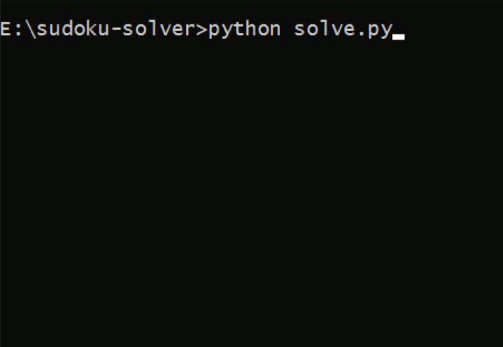
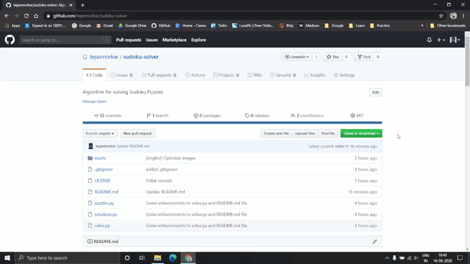
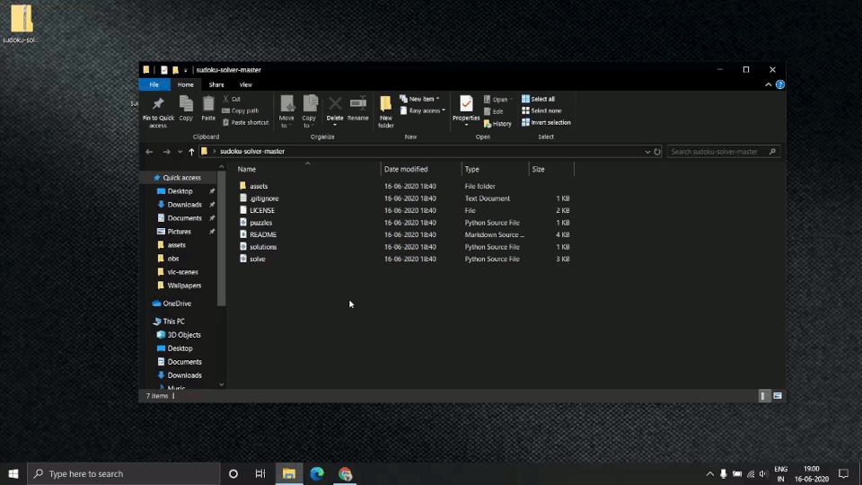

# Sudoko Solver using Backtracking Algorithm

> Sudoku is a logic-based, combinatorial number-placement puzzle. The objective is to fill a 9×9 grid with digits so that each column, each row, and each of the nine 3×3 subgrids that compose the grid contain all of the digits from 1 to 9.
> (Source - [Wikipedia](https://en.wikipedia.org/wiki/Sudoku))

This is a project which takes an input of the sudoku puzzles as an 81 characters long string containing the digits from 0 to 9, where 0 represents an unfilled cell of the Sudoku Board. The objective of the algorithm is to replace all the zeros with valid digits such that the entire Sudoku Puzzle is solved. For doing this in a conventional way, the processor will require to try all 2*1077 possible combinations in a worst case scenario which is a huge number. So, to solve this problem in a comparatively less time, the **Backtracking Algorithm** is one of the best solutions to it.

## Table of Contents

1. [Requirements](#requirements)
2. [Usage](#usage)
3. [Future Works](#future-works)
4. [Send Me Queries or Feedback](#send-me-queries-or-feedback)
5. [License](#license)

## Requirements

To download and use this code, the minimum requirements are:

* [Python 3.0](https://www.python.org/download/releases/3.0/) and above **OR** [Python 2.2](https://www.python.org/download/releases/2.2/) and above

## Usage

Once the requirements are checked, you can easily download this project and use it on your machine in few simple steps.

* **STEP 1**  
    Download this repository as a zip file onto your machine and extract all the files from it.

    

     

* **STEP 2**  
  Run the [solve.py](./solve.py) file using python to see the solution

  

> NOTE:
>  
> 1 - If you are using Linux or Mac you will need to change one line of code. Instructions for which are commented in the same file on line #3.
>  
> 2 - The algorithm takes only ~1 second to compute most of the Sudoku Puzzles. It takes more time to show the output on every iteration. So, if you want to skip the visualization part to speed it up, feel free to comment out the lines #28 to #30.

* **STEP 3**  
  You can change last digits of the `puzzle0` and `solution0` on lines #5 and #6, respectively, to check the algorithm for different puzzles. There are 5 demo puzzles already given in the [puzzles.py](./puzzles.py) file and their respective solutions are stored in the [solutions.py](./solutions.py) file. Feel free to add your own puzzles to explore more.

## Future Works

This is a basic academic project and I am planning on exploring other ideas to make it more interesting and intuitive. Some of the things I'm working on currently are listed below.

1. Trying different algorithms than the Backtracking such as Stochastic search, Constraint programming, Exact cover, and others.
2. Exploring the use of Machine Learning algorithms to solve Sudoku Puzzles using a [dataset available on Kaggle](https://www.kaggle.com/rohanrao/sudoku) which provides 9 million Sudoku Puzzle-Solution pairs.
3. Using Convolutional Neural Networks and Image processing to detect Sudoku Puzzles from the hard copies and then displaying the found solutions onto it using the AR (Augmented Reality) Technology.

## Send Me Queries or Feedback

It is all opensource and for further research purpose, so contact me if you...

1. ...have some valuable inputs to share
2. ...want to work on it
3. ...find any bug
4. ...want to share a feedback on the work
5. ...etc.

Send me a mail at [tejasmorkar@gmail.com](tejasmorkar@gmail.com) or [create a new Issue](https://github.com/tejasmorkar/sudoku-solver/issues/new) on this repository.
You can also contact me through my [LinkedIn Profile](https://www.linkedin.com/in/tejasmorkar/).

## License

This project is freely available for free non-commercial/ commercial use, and may be redistributed under these conditions. Please, see the [license](./LICENSE) for further details.
